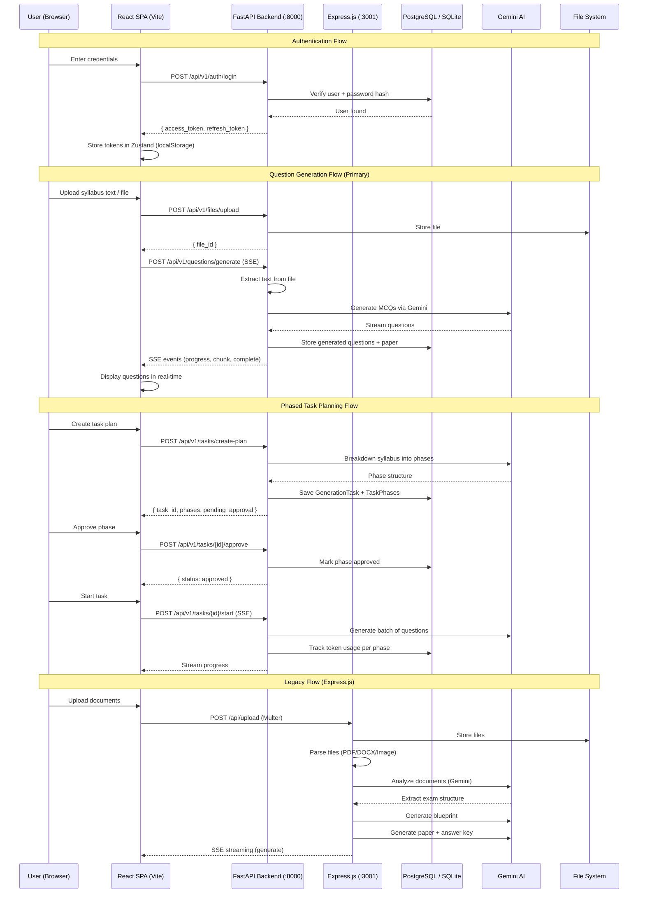
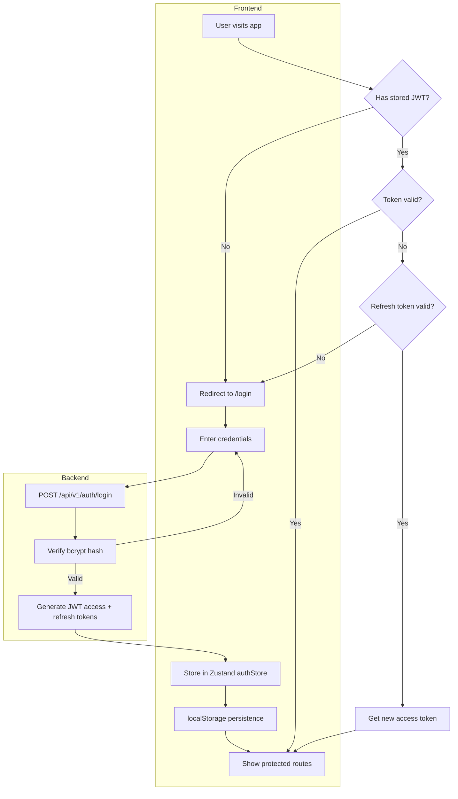
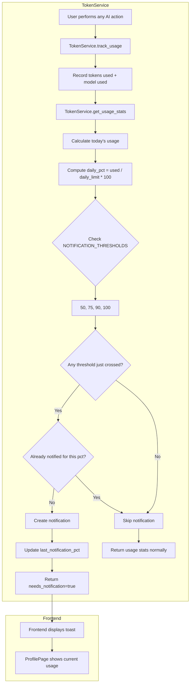
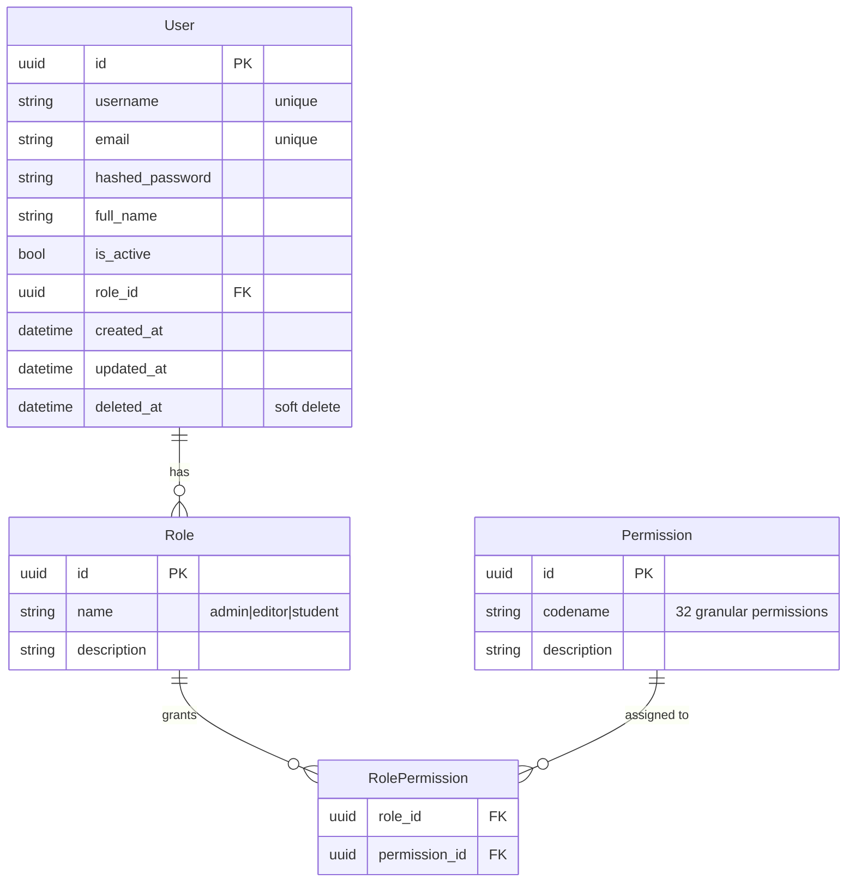
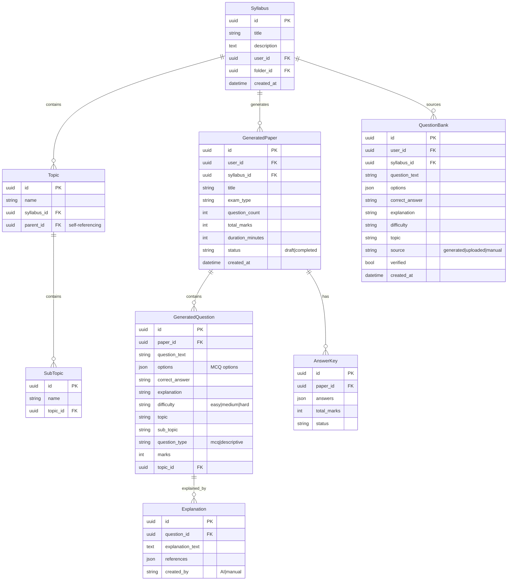
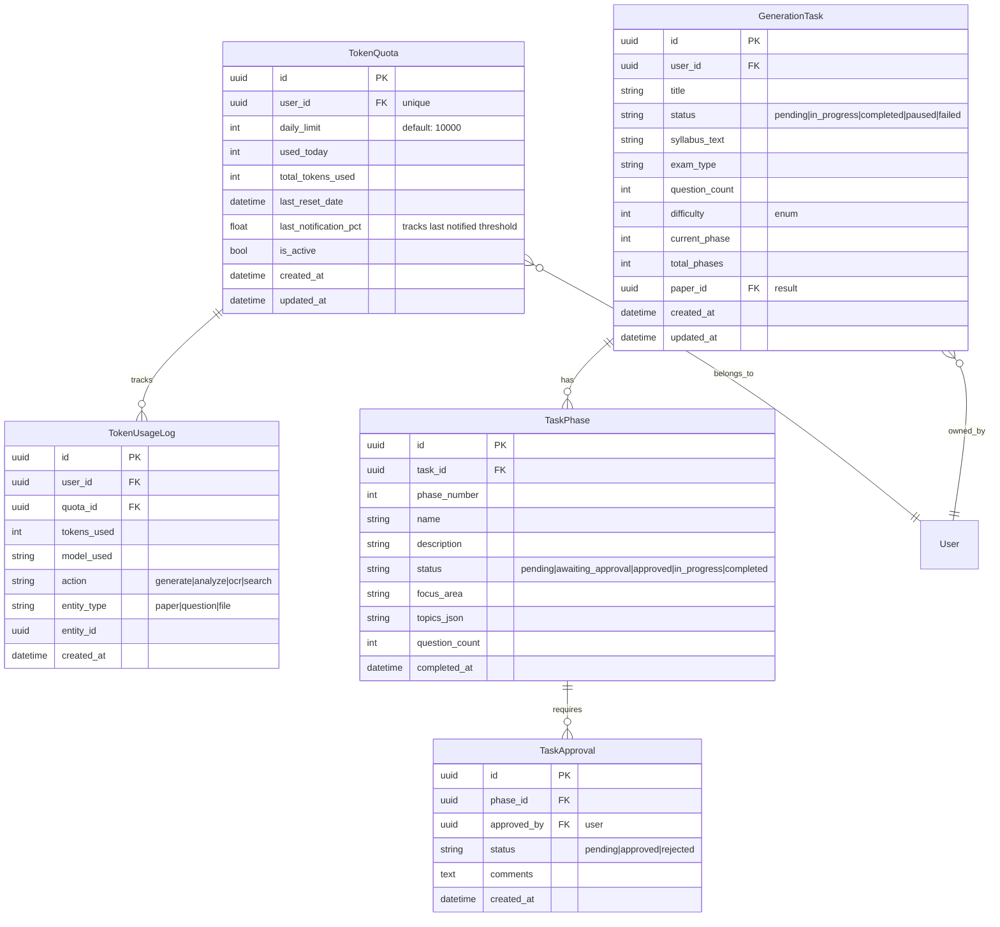
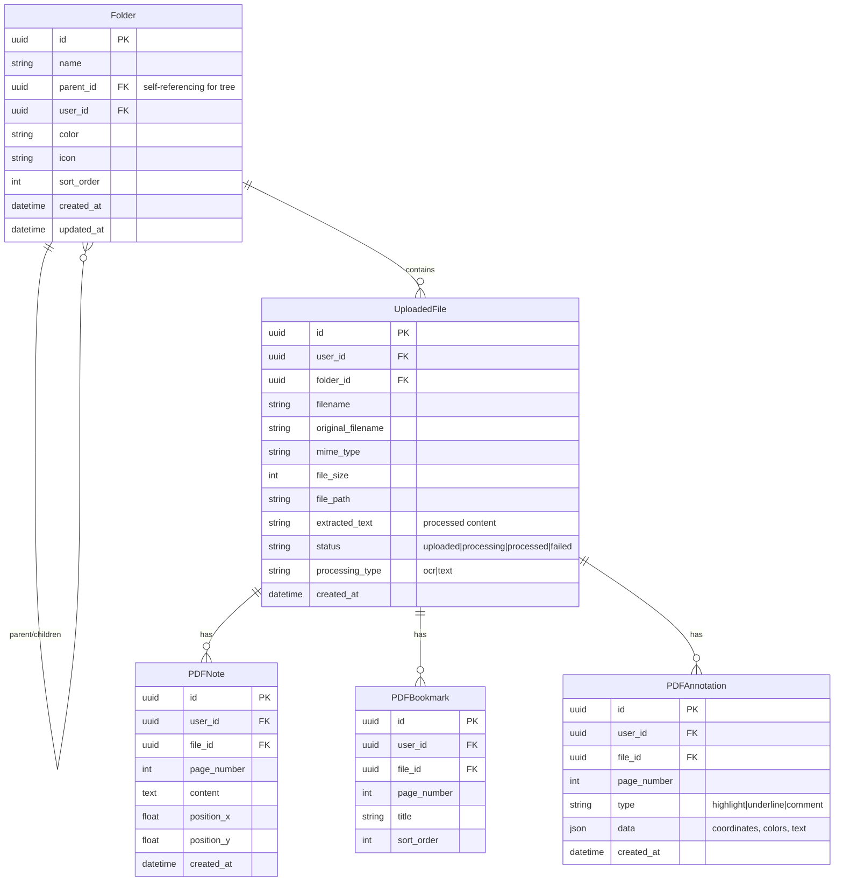

# KKE Question Paper Generator

AI-powered exam paper generator for Karnataka Government exams. Built with **FastAPI (Python)** as the primary backend, **React + Vite + TypeScript** as the frontend, and **Express.js (Node.js)** as a secondary/legacy backend.

---

## Table of Contents

- [Architecture Overview](#architecture-overview)
- [Technology Stack](#technology-stack)
- [Project Structure](#project-structure)
- [Feature Flows](#feature-flows)
  - [Authentication Flow](#authentication-flow)
  - [Syllabus Upload & Question Generation Flow](#syllabus-upload--question-generation-flow)
  - [Phased Task Planning & Auto-Resume Flow](#phased-task-planning--auto-resume-flow)
  - [Token Quota Tracking & Notification Flow](#token-quota-tracking--notification-flow)
  - [File Management Flow](#file-management-flow)
  - [Admin Dashboard Flow](#admin-dashboard-flow)
- [Data Model Diagrams](#data-model-diagrams)
- [Setup & Installation](#setup--installation)
- [Running the Project](#running-the-project)
- [API Endpoints](#api-endpoints)
- [Environment Variables](#environment-variables)
- [Contributing](#contributing)

---

## Architecture Overview

```
┌─────────────────────────────────────────────────────────────────────────────┐
│                        KKE Question Paper Generator                         │
│                                                                             │
│  ┌──────────────────────────┐           ┌────────────────────────────────┐  │
│  │                          │           │                                │  │
│  │   React SPA (Vite 8)    │◄─────────►│    FastAPI Backend (:8000)     │  │
│  │   localhost:5173         │  REST +   │    /api/v1/* (primary)         │  │
│  │                          │   SSE     │                                │  │
│  │   ┌─────────────────┐    │           │  ┌──────────────────────────┐  │  │
│  │   │ Pages (9)       │    │           │  │ Routers (11 modules)     │  │  │
│  │   │ Components (8)  │    │  JWT      │  │ Services (7 modules)     │  │  │
│  │   │ Stores (3)      │    │  Bearer   │  │ Models (17 SQLAlchemy)   │  │  │
│  │   │ Hooks (3)       │    │  Auth     │  │ Schemas (5 Pydantic)     │  │  │
│  │   │ API Client      │    │           │  │ Core (JWT + RBAC)        │  │  │
│  │   └─────────────────┘    │           │  └──────────────────────────┘  │  │
│  └──────────────────────────┘           │                                │  │
│                                         │  DB: SQLite / Supabase PG      │  │
│      ┌──────────────────────┐          │  AI: Gemini 2.0 Flash          │  │
│      │  Express.js (:3001)  │          │  OCR: Tesseract                │  │
│      │  /api/* (legacy)     │          └────────────────────────────────┘  │
│      │  Routes: exams,      │                                             │
│      │  upload, analyze,    │          ┌────────────────────────────────┐  │
│      │  generate, papers,   │          │  Shared Infrastructure        │  │
│      │  questions           │          │  ─────────────────────        │  │
│      │                      │          │  Gemini AI (both backends)    │  │
│      │  AI: Gemini 2.5 Flash│          │  File System (uploads/)       │  │
│      │  DB: better-sqlite3  │          │  SQLite / Supabase            │  │
│      └──────────────────────┘          └────────────────────────────────┘  │
└─────────────────────────────────────────────────────────────────────────────┘
```

### Client-Server Interaction Diagram



---

## Technology Stack

### Frontend
| Category | Technology |
|----------|-----------|
| Framework | React 19, TypeScript 6 |
| Build | Vite 8 |
| Styling | Tailwind CSS 4, Radix UI primitives, lucide-react icons |
| State | Zustand 5 (authStore, appStore, folderStore) |
| Data Fetching | TanStack Query 5, Fetch API |
| Routing | React Router 7 |
| Forms | react-hook-form + zod 4 |
| Animations | framer-motion |
| Utilities | date-fns, tailwind-merge, clsx, class-variance-authority |
| Toast | Custom shadcn-style reducer pattern |

### Primary Backend (Python FastAPI)
| Category | Technology |
|----------|-----------|
| Framework | FastAPI, Uvicorn |
| ORM | SQLAlchemy 2.0 (async) |
| Migrations | Alembic |
| Validation | Pydantic v2 |
| Auth | JWT (HS256) + bcrypt password hashing |
| RBAC | 3 roles (admin, editor, student), 32 granular permissions |
| AI | google-generativeai (Gemini 2.0 Flash) |
| OCR | Tesseract (pytesseract + pdf2image + OpenCV) |
| Task Queue | Celery + Redis |
| Logging | Loguru |
| Rate Limiting | slowapi |
| File Parsing | PyMuPDF, pdfplumber, python-docx, python-pptx, openpyxl |
| PDF Generation | reportlab, pdfminer.six |

### Secondary Backend (Express.js)
| Category | Technology |
|----------|-----------|
| Runtime | Node.js, TypeScript |
| Framework | Express 4 |
| AI | Google AI SDK (Gemini 2.5 Flash) |
| Database | better-sqlite3 or Supabase JS SDK |
| File Upload | Multer (50MB, 5 files) |
| File Parsing | pdf-parse, mammoth |
| PDF Export | pdfmake |
| DOCX Export | docx |
| Security | helmet, cors |

### Database
| Mode | Technology |
|------|-----------|
| Production | PostgreSQL (Supabase) |
| Development | SQLite (auto-fallback, `data/kke.db`) |

---

## Project Structure

```
KKE_QUESTION_PAPER_GENERATOR/
│
├── .gitignore
├── package.json                    # Root orchestrator (concurrently)
├── README.md                       # Project documentation
├── run_project.bat                 # One-click Windows runner
├── run_project.ps1                 # One-click PowerShell runner
├── run_project.py                  # One-click Python runner
├── run_project.sh                  # One-click Linux/Mac runner
│
├── database/                       # === DATABASE MIGRATIONS & SCHEMA ===
│   ├── alembic.ini                 # Alembic configuration
│   ├── alembic/                    # Migration scripts
│   ├── migrate_db.py               # SQLite migration utility
│   └── schema.sql                  # Supabase/PostgreSQL schema
│
├── backend/
│   ├── .env / .env.example
│   ├── requirements.txt
│   ├── docker-compose.yml
│   ├── Dockerfile
│   ├── data/                        # SQLite runtime DB
│   ├── logs/                        # Log files
│   ├── uploads/                     # User file uploads
│   │
│   ├── app/                         # === PYTHON FASTAPI BACKEND ===
│   │   ├── main.py                  # App entrypoint (middleware, routers, CORS)
│   │   ├── config.py                # Pydantic Settings (env vars)
│   │   ├── database.py              # Async SQLAlchemy engine + session
│   │   │
│   │   ├── api/
│   │   │   ├── deps.py              # DI: get_db, get_current_user, pagination
│   │   │   └── v1/
│   │   │       ├── auth.py          # POST /login, /register, /refresh
│   │   │       ├── profile.py       # GET /tokens, /quota, /check-quota
│   │   │       ├── questions.py     # POST /generate (SSE), /syllabus-generate
│   │   │       ├── syllabus.py      # GET / (list), /exam-patterns
│   │   │       ├── tasks.py         # POST /create-plan, /approve, /start, /auto-resume
│   │   │       ├── files.py         # POST /upload, /process
│   │   │       ├── search.py        # GET / (global search)
│   │   │       ├── folders.py       # CRUD + /tree
│   │   │       ├── pdf_reader.py    # PDF notes/bookmarks/annotations
│   │   │       └── admin.py         # Dashboard stats, user mgmt, audit logs
│   │   │
│   │   ├── core/
│   │   │   ├── security.py          # JWT create/verify, bcrypt hashing
│   │   │   └── permissions.py       # RoleEnum, PermissionEnum, ROLE_PERMISSIONS
│   │   │
│   │   ├── models/                  # 17 SQLAlchemy ORM models
│   │   │   ├── base.py              # Base + TimestampMixin (UUID PK, timestamps)
│   │   │   ├── user.py              # User, Role, Permission
│   │   │   ├── token_quota.py       # TokenQuota, TokenUsageLog
│   │   │   ├── generation_task.py   # GenerationTask, TaskPhase, TaskApproval
│   │   │   ├── question.py          # PreviousYearQuestion, QuestionBank, GeneratedPaper
│   │   │   ├── syllabus.py          # Syllabus, Topic, SubTopic
│   │   │   ├── uploaded_file.py     # UploadedFile
│   │   │   ├── exam_pattern.py      # ExamPattern
│   │   │   ├── answer_key.py        # AnswerKey, Explanation
│   │   │   ├── current_affair.py    # CurrentAffair, GovernmentScheme
│   │   │   ├── ocr_data.py          # OCRData, Image
│   │   │   ├── ai_job.py            # AIJob, PromptTemplate
│   │   │   ├── log.py               # AuditLog, ActivityLog
│   │   │   ├── setting.py           # Setting
│   │   │   ├── pdf_note.py          # PDFNote, PDFBookmark, PDFAnnotation
│   │   │   └── folder.py            # Folder
│   │   │
│   │   ├── schemas/                 # Pydantic request/response schemas
│   │   │   ├── user.py              # UserCreate, LoginRequest, TokenResponse
│   │   │   ├── question.py          # QuestionGenerate, PaperResponse
│   │   │   ├── file.py              # FileUploadResponse
│   │   │   ├── folder.py            # FolderCreate, FolderTreeResponse
│   │   │   └── pdf_note.py          # PDFNoteCreate/Response
│   │   │
│   │   └── services/                # Business logic layer
│   │       ├── auth_service.py      # User CRUD, login, refresh, RBAC
│   │       ├── ai_service.py        # Gemini API wrapper (generate, stream, validate)
│   │       ├── question_service.py  # Paper generation pipeline, search, dedup
│   │       ├── task_service.py      # Phased tasks, auto-resume, batch generation
│   │       ├── token_service.py     # Quota tracking, daily limits, notifications
│   │       ├── file_service.py      # File storage/retrieval
│   │       └── ocr_service.py       # Tesseract OCR, text extraction
│   │
│   └── src/                         # === EXPRESS.JS SECONDARY BACKEND ===
│       ├── index.ts                 # Express app (:3001)
│       ├── shared/                  # Shared TypeScript types
│       │   └── types.ts
│       ├── routes/
│       │   ├── exams.ts             # Exam CRUD
│       │   ├── upload.ts            # File upload (Multer)
│       │   ├── analyze.ts           # Document analysis + blueprint (SSE)
│       │   ├── generate.ts          # Paper generation (SSE)
│       │   ├── papers.ts            # Paper CRUD + PDF/DOCX export
│       │   └── questions.ts         # Question bank search
│       ├── services/
│       │   ├── gemini.ts            # Gemini 2.5 Flash AI service
│       │   ├── supabase.ts          # Supabase CRUD operations
│       │   ├── fileParser.ts        # PDF/DOCX/TXT/Image parsing
│       │   └── export.ts            # PDF + DOCX export
│       ├── middleware/
│       │   ├── upload.ts            # Multer config
│       │   └── errorHandler.ts      # Global error handler
│       ├── prompts/
│       │   ├── systemPrompt.ts      # Master KKE paper setter persona
│       │   ├── analysisPrompt.ts    # Document analysis prompt
│       │   ├── blueprintPrompt.ts   # Blueprint generation prompt
│       │   ├── paperPrompt.ts       # Paper generation prompt
│       │   └── explanationPrompt.ts # Explanation + trap analysis prompt
│       └── db/
│           ├── index.ts             # Unified DB dispatch
│           └── sqlite.ts            # better-sqlite3 implementation
│
├── frontend/                        # === REACT + VITE + TYPESCRIPT SPA ===
│   ├── index.html
│   ├── package.json
│   ├── vite.config.ts
│   ├── tsconfig*.json
│   └── src/
│       ├── main.tsx                 # React entry point
│       ├── App.tsx                  # Router + protected routes + sidebar layout
│       ├── index.css                # Tailwind imports + theme variables
│       │
│       ├── pages/                   # 9 route pages
│       │   ├── LoginPage.tsx        # Login form with test credentials
│       │   ├── RegisterPage.tsx     # Registration form
│       │   ├── DashboardPage.tsx    # Stats, folders, syllabus-based generation
│       │   ├── UploadPage.tsx       # File upload interface
│       │   ├── ExamPage.tsx         # Exam view
│       │   ├── PaperViewPage.tsx    # Paper detail with questions
│       │   ├── FolderViewPage.tsx   # Folder contents
│       │   ├── ProfilePage.tsx      # User profile + token quota display
│       │   └── TaskPlannerPage.tsx  # Multi-phase task planner with SSE
│       │
│       ├── components/
│       │   ├── ThemeProvider.tsx     # Light/dark theme context
│       │   ├── ModeToggle.tsx       # Theme toggle button
│       │   └── ui/                  # shadcn-style primitives
│       │       ├── button.tsx       # Button with variants
│       │       ├── card.tsx         # Card layout components
│       │       ├── input.tsx        # Input field
│       │       ├── badge.tsx        # Status badge
│       │       ├── toast.tsx        # Toast notification component
│       │       └── toaster.tsx      # Toast renderer
│       │
│       ├── stores/                  # Zustand state management
│       │   ├── authStore.ts         # JWT tokens + user state (persisted)
│       │   ├── appStore.ts          # Current exam/paper context
│       │   └── folderStore.ts       # Folder tree + CRUD state
│       │
│       ├── hooks/
│       │   ├── useApi.ts            # TanStack Query hooks for all entities
│       │   ├── useSSE.ts            # Server-Sent Events hook for streaming
│       │   └── use-toast.ts         # Toast notification system
│       │
│       ├── lib/
│       │   ├── api.ts               # Full API client (~50 endpoints)
│       │   └── utils.ts             # cn() helper (tailwind-merge + clsx)
│       │
│       └── assets/
```

---

## Feature Flows

### Authentication Flow



### Syllabus Upload & Question Generation Flow

```mermaid
flowchart TD
    A[User opens Dashboard] --> B{Choose input method}
    B -->|Type syllabus text| C[Enter text in textarea]
    B -->|Upload file| D[Select PDF/DOCX/TXT/Image]
    B -->|Use existing syllabus| E[Select from saved syllabi]

    C --> F[Configure generation params]
    D --> F
    E --> F

    F --> G[Select: exam type, question count (5-500), difficulty]
    G --> H[Click Generate]

    H --> I[POST /api/v1/questions/generate]
    I --> J[Backend receives request]

    J --> K{Has syllabus text?}
    K -->|No| L[Extract text from uploaded file]
    K -->|Yes| M[Use provided text]

    L --> N[POST /api/v1/files/process - OCR if image]
    M --> N

    N --> O[Call Gemini AI: generate MCQs]
    O --> P{Streaming mode?}

    P -->|Yes| Q[SSE response: event stream]
    Q --> R[progress/chunk/complete events]
    R --> S[Frontend updates UI in real-time]
    S --> T[Questions appear as generated]

    P -->|No| U[Return all questions at once]
    U --> T

    T --> V[Parse + validate each question]
    V --> W[Check duplicates against question bank]
    W --> X[Store in: generated_papers + generated_questions]
    X --> Y[Display with expandable explanations]

    subgraph DashboardPage
        A
        B
        C
        D
        E
        F
        G
        H
        S
        Y
    end

    subgraph FastAPI
        I
        J
        K
        L
        M
        N
        O
        P
        Q
        U
        V
        W
        X
    end
```

### Phased Task Planning & Auto-Resume Flow

```mermaid
flowchart TD
    A[User opens Task Planner] --> B[Click 'Create New Plan']
    B --> C[POST /api/v1/tasks/create-plan]
    C --> D[AI breaks down syllabus into phases]
    D --> E[Save GenerationTask + TaskPhases]

    E --> F[Display phases for user review]
    F --> G[User approves each phase]

    G --> H[POST /api/v1/tasks/{id}/approve]
    H --> I[Phase status: approved]

    I --> J[Click 'Start Task']
    J --> K[POST /api/v1/tasks/{id}/start]

    K --> L{Token quota sufficient?}
    L -->|No - Check thresholds| M{Is quota reset needed?}
    M -->|Yes - Daily reset| N[Reset quota automatically]
    N --> O[Auto-resume paused tasks]
    O --> L

    M -->|No| P[Mark task as paused]
    P --> Q[Wait for quota renewal]
    Q --> R[POST /api/v1/tasks/auto-resume]
    R --> S[Find all paused tasks]
    S --> T[Resume generation from last phase]
    T --> L

    L -->|Yes| U[Generate batch of questions per phase]
    U --> V[Track token consumption]
    V --> W{Phase complete?}
    W -->|No| U
    W -->|Yes| X{More phases?}
    X -->|Yes| U
    X -->|No| Y[Task complete]

    V --> Z{Token threshold crossed?}
    Z -->|50/75/90/100%| AA[Notify user via toast]
    AA --> Z

    subgraph TaskPlannerPage
        A
        B
        F
        G
        J
        Q
    end

    subgraph Backend - TaskService
        C
        D
        E
        H
        I
        K
        L
        M
        N
        O
        P
        R
        S
        T
        U
        V
        W
        X
        Y
    end

    subgraph TokenService
        Z
        AA
    end
```

### Token Quota Tracking & Notification Flow



### File Management Flow

```mermaid
flowchart TD
    A[User uploads file] --> B[POST /api/v1/files/upload]
    B --> C[MIME type validation]
    C --> D{Valid type?}
    D -->|No| E[Reject with error]
    D -->|Yes| F[Save to uploads/{date}/ folder]

    F --> G[Create UploadedFile DB record]
    G --> H[Return file ID + metadata]

    H --> I[User chooses to process]
    I --> J[POST /api/v1/files/process/{id}]

    J --> K{File type?}
    K -->|Image| L[Tesseract OCR]
    K -->|PDF| M[PyMuPDF extract text]
    K -->|DOCX| N[python-docx extract]
    K -->|TXT| O[Read raw text]
    K -->|XLSX| P[openpyxl extract]

    L --> Q[Store extracted text]
    M --> Q
    N --> Q
    O --> Q
    P --> Q

    Q --> R[Update UploadedFile.extracted_text]
    R --> S[File ready for question generation]

    subgraph Frontend
        A
        I
    end

    subgraph FastAPI
        B
        C
        D
        E
        F
        G
        H
        J
        K
        L
        M
        N
        O
        P
        Q
        R
        S
    end
```

### Admin Dashboard Flow

```mermaid
flowchart TD
    A[Admin logs in] --> B{Role = admin?}
    B -->|No| C[Redirect to user dashboard]
    B -->|Yes| D[GET /api/v1/admin/dashboard]

    D --> E[Query DB for stats]
    E --> F[Total users, papers, questions, files]
    F --> G[Token usage across all users]
    G --> H[Recent activity timeline]
    H --> I[Return dashboard response]

    I --> J[Admin can manage users]
    J --> K[PUT /api/v1/admin/users/{id}]
    K --> L[Update role, status, permissions]

    J --> M[View audit logs]
    M --> N[GET /api/v1/admin/audit-logs]
    N --> O[Paginated activity log]

    J --> P[Manage app settings]
    P --> Q[GET /api/v1/admin/settings]

    J --> R[Monitor AI jobs]
    R --> S[GET /api/v1/admin/jobs]

    subgraph Backend (admin.py + AuthService)
        B
        D
        E
        F
        G
        H
        I
        K
        L
        N
        O
        Q
        S
    end

    subgraph Frontend Admin
        A
        C
        J
        M
        P
        R
    end
```

---

## Data Model Diagrams

### Core User & Auth Models



### Question Generation Models



### Token & Task Management Models



### File & Folder Models



---

## Setup & Installation

### Prerequisites

- **Python 3.11+** with pip
- **Node.js 18+** with npm
- **Tesseract OCR** (optional, for image text extraction)

### Quick Start (Windows)

```bash
# Clone the repository
git clone <repo-url>
cd kke-question-paper-generator

# Run the one-click launcher (auto-installs deps + starts both servers)
.\run_project.bat
```

### Manual Setup

#### 1. Backend (Python FastAPI)

```bash
cd backend

# Create virtual environment (optional but recommended)
python -m venv venv
venv\Scripts\activate  # Windows
# source venv/bin/activate  # Linux/Mac

# Install dependencies
pip install -r requirements.txt

# Set environment variables
set USE_SQLITE=1
set PYTHONPATH=.

# Initialize database
python -c "import asyncio; from scripts.init_db import main; asyncio.run(main())"

# Start backend
uvicorn app.main:app --host 0.0.0.0 --port 8000 --reload
```

#### 2. Backend (Express.js - Legacy)

```bash
cd backend/src
npm install
npm run dev
```

#### 3. Frontend (React + Vite)

```bash
cd frontend
npm install
npm run dev
```

### One-Click Launchers

| Script | Platform |
|--------|----------|
| `run_project.bat` | Windows CMD |
| `run_project.ps1` | Windows PowerShell |
| `run_project.sh` | Linux / macOS |
| `run_project.py` | Cross-platform Python |

Or use the root `package.json`:

```bash
npm run dev          # Starts both backend + frontend via concurrently
npm run dev:backend  # Start backend only
npm run dev:frontend # Start frontend only
npm run build        # Build frontend for production
```

---

## Running the Project

### Quick Run

```bash
# From project root - starts both servers
npm run dev
```

Or double-click `run_project.bat` (Windows) / `run_project.sh` (Linux/Mac).

### Access Points

| Service | URL | Description |
|---------|-----|-------------|
| Frontend (Vite) | http://localhost:5173 | React SPA |
| FastAPI Backend | http://localhost:8000 | Primary API |
| API Docs (Swagger) | http://localhost:8000/docs | Interactive API docs |
| API Docs (ReDoc) | http://localhost:8000/redoc | Alternative docs |
| Express Backend | http://localhost:3001 | Legacy API |

### Test Credentials

| Field | Value |
|-------|-------|
| Username | `testuser` |
| Email | `test@kke.com` |
| Password | `Test@123` |

---

## API Endpoints

### Authentication (`/api/v1/auth`)

| Method | Endpoint | Description | Auth |
|--------|----------|-------------|------|
| GET | `/test-credentials` | Get test credentials | No |
| POST | `/register` | Register new user | No |
| POST | `/login` | Login, returns JWT tokens | No |
| POST | `/refresh` | Refresh access token | Refresh |
| GET | `/me` | Get current user | Yes |
| PUT | `/me` | Update profile | Yes |
| POST | `/change-password` | Change password | Yes |

### Questions (`/api/v1/questions`)

| Method | Endpoint | Description | Auth |
|--------|----------|-------------|------|
| POST | `/generate` | Generate questions (SSE stream) | Yes |
| POST | `/syllabus-generate` | Generate from saved syllabus | Yes |
| POST | `/upload-and-generate` | Upload + generate in one call | Yes |
| GET | `/papers` | List generated papers | Yes |
| GET | `/papers/{id}` | Get paper with questions | Yes |
| DELETE | `/papers/{id}` | Delete paper | Yes |
| GET | `/question-bank` | Search question bank | Yes |

### Tasks (`/api/v1/tasks`)

| Method | Endpoint | Description | Auth |
|--------|----------|-------------|------|
| GET | `/` | List user tasks | Yes |
| POST | `/create-plan` | Create phased task plan | Yes |
| POST | `/{id}/approve` | Approve a phase | Yes |
| POST | `/{id}/start` | Start task execution (SSE) | Yes |
| GET | `/{id}/status` | Get task status | Yes |
| POST | `/auto-resume` | Auto-resume paused tasks on quota reset | Yes |

### Profile & Tokens (`/api/v1/profile`)

| Method | Endpoint | Description | Auth |
|--------|----------|-------------|------|
| GET | `/tokens` | Token usage history | Yes |
| GET | `/quota` | Current quota + usage stats | Yes |
| GET | `/check-quota` | Check quota with notification check | Yes |

### Files (`/api/v1/files`)

| Method | Endpoint | Description | Auth |
|--------|----------|-------------|------|
| POST | `/upload` | Upload file | Yes |
| GET | `/` | List user files | Yes |
| GET | `/{id}` | Get file details | Yes |
| POST | `/{id}/process` | Process/OCR file | Yes |
| DELETE | `/{id}` | Delete file | Yes |

### Folders (`/api/v1/folders`)

| Method | Endpoint | Description | Auth |
|--------|----------|-------------|------|
| POST | `/` | Create folder | Yes |
| GET | `/` | List folders | Yes |
| GET | `/tree` | Get folder tree | Yes |
| GET | `/{id}` | Get folder details | Yes |
| PUT | `/{id}` | Update folder | Yes |
| DELETE | `/{id}` | Delete folder (recursive) | Yes |
| PUT | `/{id}/move` | Move folder | Yes |

### Syllabus (`/api/v1/syllabus`)

| Method | Endpoint | Description | Auth |
|--------|----------|-------------|------|
| GET | `/` | List syllabi (with filters) | Yes |
| GET | `/exam-patterns` | List exam patterns | Yes |
| GET | `/{id}` | Get syllabus with topics | Yes |

### Search (`/api/v1/search`)

| Method | Endpoint | Description | Auth |
|--------|----------|-------------|------|
| GET | `/` | Global search across entities | Yes |

### PDF Reader (`/api/v1/pdf-reader`)

| Method | Endpoint | Description | Auth |
|--------|----------|-------------|------|
| CRUD | `/notes` | PDF notes | Yes |
| CRUD | `/bookmarks` | PDF bookmarks | Yes |
| CRUD | `/annotations` | PDF annotations | Yes |

### Admin (`/api/v1/admin`)

| Method | Endpoint | Description | Auth |
|--------|----------|-------------|------|
| GET | `/dashboard` | Admin stats dashboard | Admin |
| GET | `/users` | List all users | Admin |
| PUT | `/users/{id}` | Update user | Admin |
| GET | `/audit-logs` | Paginated audit logs | Admin |
| GET | `/settings` | App settings | Admin |
| GET | `/jobs` | AI jobs list | Admin |

### Health

| Method | Endpoint | Description |
|--------|----------|-------------|
| GET | `/api/health` | Full health check (app + DB) |

---

## Environment Variables

### FastAPI Backend (`backend/.env`)

| Variable | Default | Description |
|----------|---------|-------------|
| `USE_SQLITE` | `1` | Use SQLite instead of PostgreSQL |
| `GEMINI_API_KEY` | — | Google Gemini API key for AI features |
| `JWT_SECRET_KEY` | auto-generated | Secret for JWT signing |
| `JWT_ALGORITHM` | `HS256` | JWT signing algorithm |
| `ACCESS_TOKEN_EXPIRE_MINUTES` | `30` | Access token validity |
| `REFRESH_TOKEN_EXPIRE_DAYS` | `7` | Refresh token validity |
| `SUPABASE_DB_URL` | — | PostgreSQL connection string |
| `REDIS_URL` | `redis://localhost:6379` | Redis for Celery |
| `CELERY_BROKER_URL` | `redis://localhost:6379` | Celery broker |
| `CORS_ORIGINS` | `http://localhost:3000,http://localhost:5173` | Allowed CORS origins |
| `RATE_LIMIT` | `60/minute` | API rate limit |
| `LOG_LEVEL` | `DEBUG` | Logging level |
| `TESSERACT_CMD` | `tesseract` | Tesseract OCR executable path |

### Frontend (`frontend/.env`)

| Variable | Default | Description |
|----------|---------|-------------|
| `VITE_API_URL` | `http://localhost:8000/api/v1` | Backend API base URL |

---

## Key Design Decisions

### Why Two Backends?

The project evolved from a Node.js prototype (Express.js + Supabase) to a more robust Python FastAPI implementation. The Express.js backend remains for legacy compatibility but all new development happens in FastAPI.

### Token Quota System

Every AI action costs tokens. The `TokenService` tracks:
- **Daily limit**: Configurable per user (default: 10,000 tokens)
- **Per-action tracking**: Records tokens used per model, per action type
- **Threshold notifications**: Users are notified at 50%, 75%, 90%, and 100% of daily limit
- **Auto-resume**: Tasks paused due to quota are automatically resumed on daily reset

### Phased Task Planning

Large question generation jobs are broken into phases by AI:
1. AI analyzes the syllabus
2. Splits it into logical phases (e.g., by topic or unit)
3. User reviews and approves each phase
4. Each phase generates questions independently
5. If quota runs out, task pauses and auto-resumes when quota resets

### SSE Streaming

Question generation uses Server-Sent Events (SSE) for real-time updates:
- `progress`: Current generation status
- `chunk`: New question generated
- `complete`: All questions done
- `error`: Generation failed

The frontend uses `fetch()` with a ReadableStream reader (not native `EventSource`) to support Authorization headers.

---

## Troubleshooting

### Backend won't start

```bash
# Check Python version
python --version  # Need 3.11+

# Verify dependencies installed
pip list | grep fastapi

# Try running directly with error output
cd backend
set PYTHONPATH=.
set USE_SQLITE=1
python -c "from app.main import app; print('OK')"

# Check .env file exists
```

### Frontend build fails

```bash
cd frontend
npm install
npx tsc --noEmit  # Check TypeScript errors
npx vite build     # Full build
```

### Database issues

```bash
# Delete SQLite DB and reinitialize
del backend\data\kke.db
cd backend
set PYTHONPATH=.
python -c "import asyncio; from scripts.init_db import main; asyncio.run(main())"
```

### Token quota not showing

```bash
# Check quota endpoint directly
curl http://localhost:8000/api/v1/profile/quota -H "Authorization: Bearer <token>"
```

---

## Contributing

1. All new development goes in the **FastAPI backend** (`backend/app/`)
2. Follow existing code patterns (async SQLAlchemy, Pydantic schemas, service layer)
3. Use `ruff` for Python linting
4. Frontend follows the existing component patterns (shadcn-style, Zustand stores)
5. Run `npx tsc --noEmit` in `frontend/` before committing frontend changes
6. Run `python -c "from app.main import app"` in `backend/` to verify imports

---

## License

Private / Proprietary — Karnataka Knowledge Corporation
